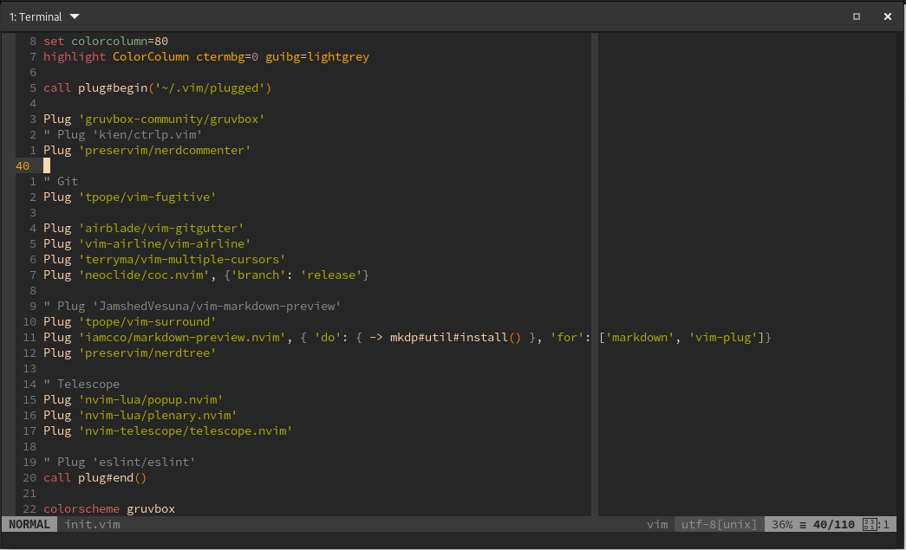

This is my personal Neovim configuration file. Feel free to copy and use it as you wish. Any feedbacks are welcome too!



## Requirements

- Install Git
- Install [neovim](https://github.com/neovim/neovim)
- Install [vim-plug](https://github.com/junegunn/vim-plug)

## Setup

Simply run `./setup.sh`. This command will create symbolic links with this project files and folders with your system's nvim folders, so that you can centralize all further updates in a single location. Also, it will create a `~/.nvimrc` file to simplify access to main nvim (a.k.a. `init.vim`) config file.

Another thing here is that you can split your `init.vim` file in some short and specific plugin config files. Just create a new file inside `plugin/your-plugin-config.nvim.vim` and put your plugin configuration there.

I also like to add an alias to my shell config file, e.g. `~./zshrc` to use `vim` command to open `nvim`.

```
# ~/.zshrc file
alias vim=nvim
```

And then, open the `init.vim` and execute `:PlugInstall` to install all plugins.

That's it!

And thanks to [ThePrimeagen](https://www.youtube.com/channel/UC8ENHE5xdFSwx71u3fDH5Xw) for the vim tips, I really learn a lot from this guy.